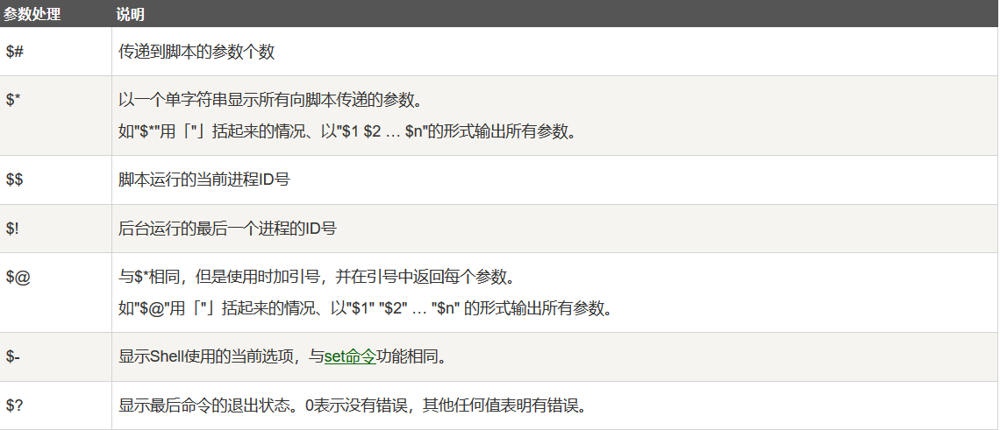
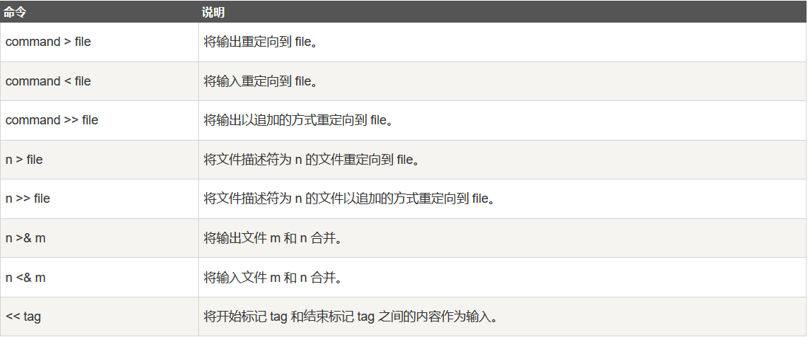

# Shell学习笔记


## Windows调用Shell脚本方法
使用`Git Bash`启动命令行，以`test.sh`为例，输入`./test.sh`命令即可运行脚本程序。

## Shell字符串
Shell字符串可以用单引号，也可以用双引号，也可以不用引号。

单引号字符串的限制：
- 单引号里的任何字符都会原样输出，单引号字符串中的变量是无效的
- 单引号字串中不能出现单独一个的单引号（对单引号使用转义符后也不行），但可成对出现，作为字符串拼接使用

 双引号的优点：
- 双引号里可以有变量
- 双引号里可以出现转义字符

## Shell命令行参数处理


参数校验：
```shell
if [ -n "$1" ]; then
    echo "包含第一个参数"
else
    echo "没有包含第一参数"
fi
```

## Shell中括号用法
Shell 里面的中括号（包括单中括号与双中括号）可用于一些条件的测试：
- 算术比较。比如一个变量是否为0：`[ $var -eq 0 ]`
    - `-eq` : 等于
    - `-ne` : 不等于
    - `-gt` : 大于
    - `-lt` : 小于
    - `-ge` : 大于或等于
    - `-le` : 小于或等于
- 文件系统属性测试。比如一个文件是否存在：`[ -e $var ]`，是否是目录：`[ -d $var ]`
    - `[ -f $file_var ]` : 变量 `$file_var` 是一个正常的文件路径或文件名 (file)，则返回真
    - `[ -x $var ]` : 变量 `$var` 包含的文件可执行 (execute)，则返回真
    - `[ -d $var ]` : 变量 `$var` 包含的文件是目录 (directory)，则返回真
    - `[ -e $var ]` : 变量 `$var` 包含的文件存在 (exist)，则返回真
    - `[ -c $var ]` : 变量 `$var` 包含的文件是一个字符设备文件的路径 (character)，则返回真
    - `[ -b $var ]` : 变量 `$var` 包含的文件是一个块设备文件的路径 (block)，则返回真
    - `[ -w $var ]` : 变量 `$var` 包含的文件可写(write)，则返回真
    - `[ -r $var ]` : 变量 `$var` 包含的文件可读 (read)，则返回真
    - `[ -L $var ]` : 变量 `$var` 包含是一个符号链接 (link)，则返回真
- 字符串比较。比如两个字符串是否相同：`[[ $var1 = $var2 ]]`
    - `[[ $str1 = $str2 ]]` : 如果 str1 与 str2 相同，则返回真
    - `[[ $str1 != $str2 ]]` : 如果 str1 与 str2 不相同，则返回真
    - `[[ -z $str1 ]]` : 如果 str1 是空字符串，则返回真
    - `[[ -n $str1 ]]` : 如果 str1 是非空字符串，则返回真

## Shell注释
- 单行注释 : `# 注释内容...`
- 多行注释 : 
    ```shell
    :<<EOF
    注释内容...
    注释内容...
    注释内容...
    EOF
    ```

## Shell重定向

